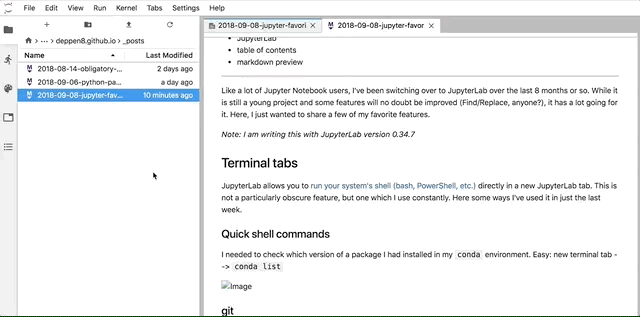
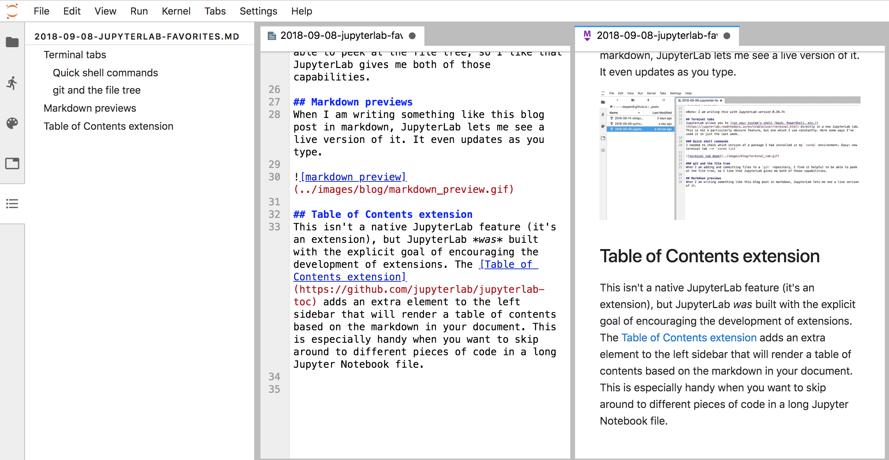
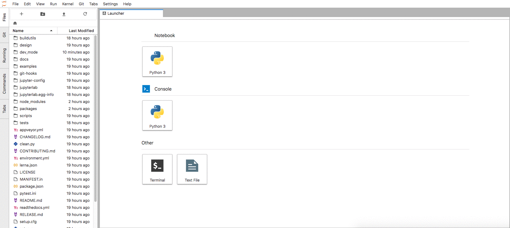

Like a lot of Jupyter Notebook users, I've been switching over to JupyterLab over the last 8 months or so. While it is still a young project and some features will no doubt be improved (Find/Replace, anyone?), it has a lot going for it. Here, I just wanted to share a few of my favorite features.

*Note: I am writing this with JupyterLab version 0.34.7*

## Terminal tabs
JupyterLab allows you to [run your system's shell (bash, PowerShell, etc.)](https://jupyterlab.readthedocs.io/en/stable/user/terminal.html) directly in a new JupyterLab tab. This is not a particularly obscure feature, but one which I use constantly. Here some ways I've used it in just the last week.

### Quick shell commands
I needed to check which version of a package I had installed in my `conda` environment. Easy: new terminal tab --> `conda list`

### git and the file tree
When I am adding and committing files to a `git` repository, I find it helpful to be able to peek at the file tree, so I like that JupyterLab gives me both of those capabilities.

## Markdown previews
When I am writing something like this blog post in markdown, JupyterLab lets me see a live version of it. It even updates as you type.

## Extensions
JupyterLab was built with the explicit goal of encouraging the development of extensions. Already, there have been some quite nifty extensions produced.

### Table of Contents extension
The [Table of Contents extension](https://github.com/jupyterlab/jupyterlab-toc) adds an extra element to the left sidebar that will render a table of contents based on the markdown in your document. This is especially handy when you want to skip around to different pieces of code in a long Jupyter Notebook file (or anything else written with markdown).

### git extension
I haven't actually used the git extension yet, but I am looking forward to trying it out. Here is a demo from the [project's GitHub repo](https://github.com/jupyterlab/jupyterlab-git).

I like the look of the interface and moving the files up and down through the statuses seems like an intuitive design.