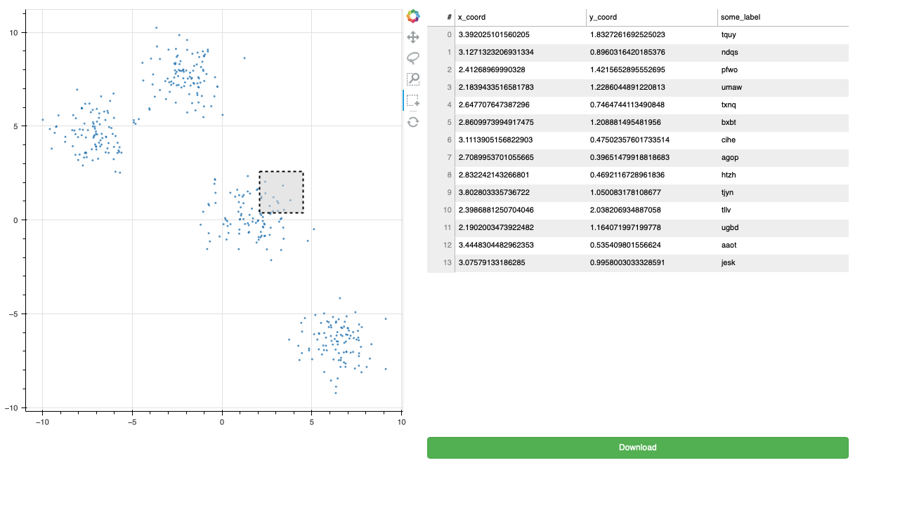

# Bokeh scatter linked to table with download

This project is a minimal proof-of-concept for linking a scatterplot selection to a table in Bokeh. The viz also contains a "Download" button that triggers a `download.js` script which will save the current table as a CSV file.

## Requirements

Created with `bokeh==2.3.0` and `Python 3.9.2`. Not tested with other versions.
